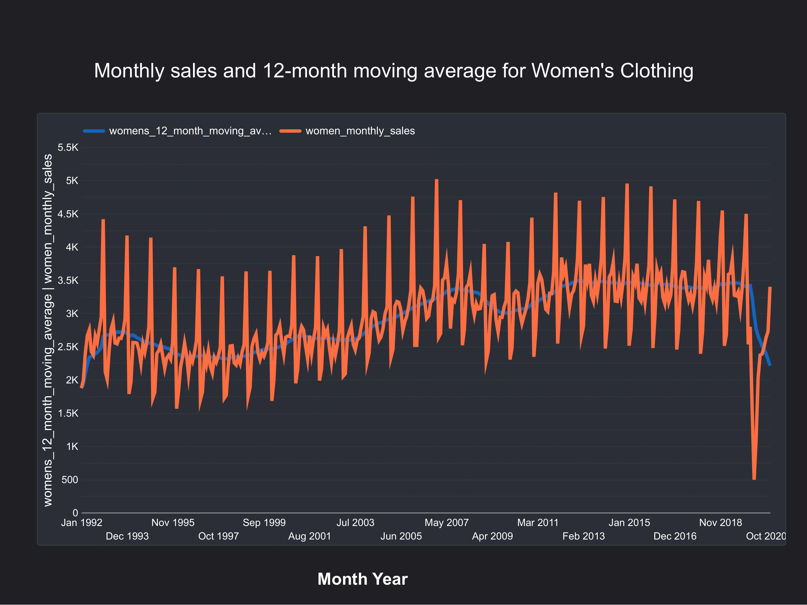

# sql-time-series-analysis
Advanced Analytical Engineering project demonstrating complex time series data modeling entirely in SQL (PostgreSQL). Focuses on cohort retention, rolling window calculations, and seasonality analysis

### Dataset - The Retail Sales Dataset
This dataset is a set of monthly US retail sales from the Monthly Retail Trade Report: Retail and Food Services Sales: Excel (1992– present), available on the Census.gov website. The data in this report is used as an economic indicator to understand trends in US consumer spending patterns. While gross domestic product (GDP) figures are published quarterly, this retail sales data is published monthly, so it is also used to help predict GDP. 

